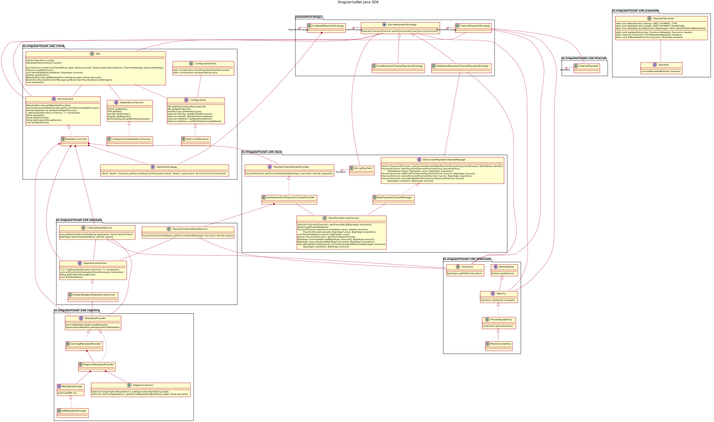

# SingularityNet Java SDK

[](https://circleci.com/gh/singnet/snet-sdk-java)
[](https://codecov.io/gh/singnet/snet-sdk-java)
[](https://jitpack.io/#singnet/snet-sdk-java)
[](https://jitpack.io/com/github/singnet/snet-sdk-java/snet-sdk-java/master-SNAPSHOT/javadoc)

## Implementing SingularityNet service client in Java

1. Create new maven project, see [Maven getting
   started](https://maven.apache.org/guides/getting-started/maven-in-five-minutes.html)
   Add [Jitpack](https://jitpack.io/) maven repo into the project to be able
   using SingularityNet Java SDK artifacts:
```xml
<project>

  <repositories>
    <repository>
      <id>jitpack.io</id>
      <url>https://jitpack.io</url>
    </repository>
  </repositories>

</project>
```

2. Use `snet-sdk-maven-plugin` to get service protobuf API within your project:

```xml
<project>
  <build>
    <plugins>

      <plugin>
        <groupId>com.github.singnet.snet-sdk-java</groupId>
        <artifactId>snet-sdk-maven-plugin</artifactId>
        <version>master-SNAPSHOT</version>

        <executions>
          <execution>

            <configuration>
              <!-- service organization id -->
              <orgId>snet</orgId>
              <!-- service id -->
              <serviceId>cntk-image-recon</serviceId>
              <!-- API output dir -->
              <outputDir>${project.build.directory}/proto</outputDir>
              <!-- desired java package for classes generated -->
              <javaPackage>io.singularitynet.exampleservice</javaPackage>
              <!-- Ethereum RPC endpoint to use -->
              <ethereumJsonRpcEndpoint>io.singularitynet.service.cntkimagerecon</ethereumJsonRpcEndpoint>
            </configuration>

            <goals>
              <goal>get</goal>
            </goals>

          </execution>
        </executions>

      </plugin>

    </plugins>
  </build>
</project>
```

3. Add SingularityNet Java SDK as dependency:

```xml
	<dependency>
	    <groupId>com.github.singnet.snet-sdk-java</groupId>
	    <artifactId>snet-sdk-java</artifactId>
	    <version>master-SNAPSHOT</version>
	</dependency>
```

4. Use `protobuf-maven-plugin` to generate Java stubs of service API:
- [grpc-java README.md](https://github.com/grpc/grpc-java/blob/master/README.md)
- [protobuf-maven-plugin documentation](https://www.xolstice.org/protobuf-maven-plugin/)

5. Write Java client app using SDK API, see [CntkImageRecognition.java](./example/cli/cntk-image-recognition/src/main/java/io/singularitynet/sdk/example/CntkImageRecognition.java)
as example:

```java
    // Create SDK configuration
    StaticConfiguration config = StaticConfiguration.newBuilder()
        .setEthereumJsonRpcEndpoint("https://mainnet.infura.io/v3/" /* + your infura project id */)
        .setIpfsEndpoint("http://ipfs.singularitynet.io:80")
        .setIdentityType(Configuration.IdentityType.PRIVATE_KEY)
        .setIdentityPrivateKey(new byte[] { /* identity private key */ });

    // Create SDK instance
    Sdk sdk = new Sdk(config);
    try {

        // Choose payment strategy
        PaymentStrategy paymentStrategy = new OnDemandPaymentChannelPaymentStrategy(sdk);

        // Create new service client instance
        ServiceClient serviceClient = sdk.newServiceClient("snet",
                "cntk-image-recon", "default_group", paymentStrategy); 
        try {

            // Get gRPC API stub
            RecognizerBlockingStub stub = serviceClient.getGrpcStub(RecognizerGrpc::newBlockingStub);
            
            // Call method
            Input input = Input.newBuilder()
                .setModel("ResNet152")
                .setImgPath("https://d2z4fd79oscvvx.cloudfront.net/0027071_1_single_rose_385.jpeg")
                .build();
            Output output = stub.flowers(input);
            System.out.println("Response received: " + output);

        } finally {
            // Shutdown service client
            serviceClient.shutdownNow();
        }

    } finally {
        // Shutdown SDK
        sdk.shutdown();
    }
```

## How to build

Integration testing is disabled by default. To run full build including
integration tests use:
```
mvn install -DskipITs=false -P run-integration-environment
```

The command about automatically starts integration environment docker before
running tests and stops after it. To start integration environment manually
execute:
```
docker run -d \
    --name java-sdk-integration-environment \
    -p 5002:5002 -p 8545:8545 -p 7000:7000 \
    singularitynet/java-sdk-integration-test-env:2.0.2
```
Then you can run build with integration testing using:
```
mvn install -DskipITs=false
```

Running integration tests is a time consuming process so to make fast build
running unit tests only use:
```
mvn install
```

## Class diagram


[Source code](./docs/class-diagram.plantuml)

